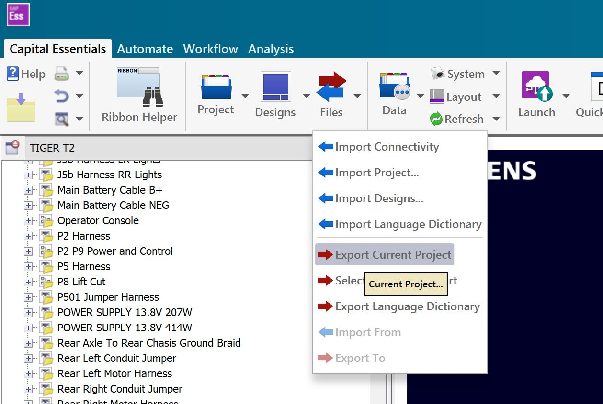
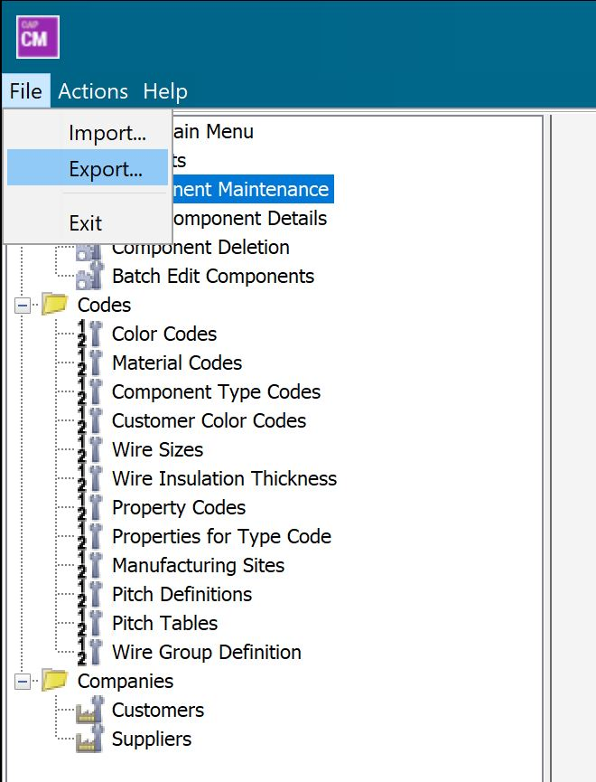
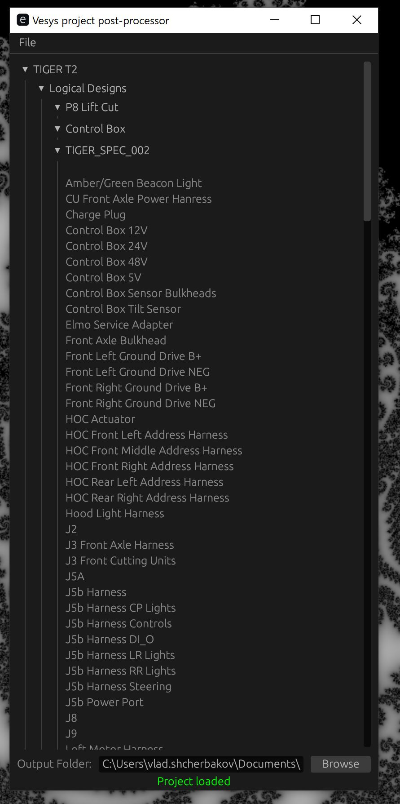

EXPORT PROJECT XML
------------------
This is a post-processor for VeSys(Capital Essentials) XML files, which you get by exporting a whole project into XML.

{width=250}

EXPORT LIBRARY XML
-------------------
The program also needs a `Library.xml` file in the same directory as `*.exe`. You can export Library XML from Component Manager.


{width=250}

BUILD
-----

This application is written in Rust.

```
cargo build
cargo run
```


OPEN PROJECT
------------

Go to File -> Open to load project XML, then you may right click on various harness items and export them into available file formats.

{width=250}


ROADMAP
------------

- Separate data from format (using Polars for intermediate data format)
- Shchleuniger ASCII output for internal harnesses
- Multi-wire terminations and indicators
- Device index (or just BOM) for harness wire list report
- Improved project outline
- Table preview
